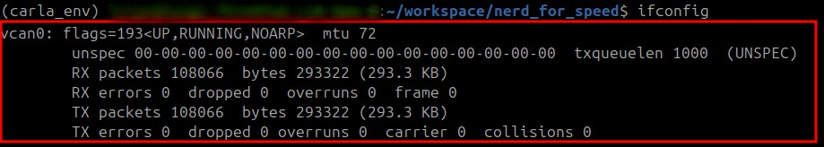
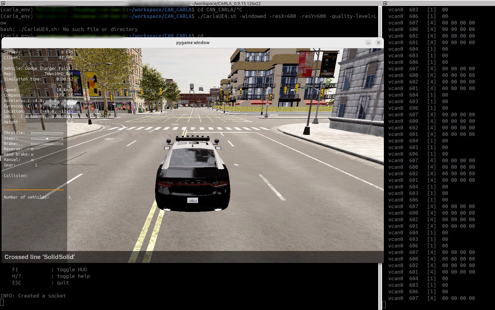

# Nerd For Speed (N4S)

Nerd For Speed is an ongoing project to create simulations based on CARLA simulator that also simulate the messages flow from in-vehicle networks (initially only CAN networks)

## Requirements

We assume that you have the following libraries and/or dependencies installed before going through the following steps:
- conda or miniconda for virtual environment management
- CARLA simulator (we have used version 0.9.15 for our experiments)
- can-utils linux package
- vulkan (if necessary)

**Disclaimer:** All the experiments were conducted using the Ubuntu operational systems. We do not guarantee it will work properly on Windows.

## Setting up the environment

First of all, you will need to create a conda environment to execute our scripts. To do so, execute the following command:

```bash
conda create --name n4s_env python=3.9
```

**Note:** We have used python 3.9 because it was the version used by many of the necessary libraries.

Next, activate the environment:
```bash
conda activate n4s_env
```

To run CARLA, you will need some other system dependencies to be acessible by conda. To install those, simply run:
```bash
conda install -c conda-forge libstdcxx-ng
```

Finally, you will need to installed the python packages. To do so, execute the comand below:
```bash
pip install -r requirements.txt
```

## Running the simulation

### Initializing virtual CAN bus using socket CAN

First of all, you will need to enable the virtual CAN bus in your Linux system. This can be done by executing the "setup_virtual_can.sh" script. This script may need "sudo" privileges to be successfully executed.

```bash
sudo sh setup_virtual_can.sh
```

To check if the virtual CAN bus was properly created, you can run the following command:

```bash
ifconfig
```

if it was properly setup, "vcan0" will be listed as one of the network interfaces as in the picture down below:
<p align="center">
  
</p>

### Executing CARLA simulator server

To execute the CARLA simulator, go to the folder were it was cloned/installed and run the following command:

```bash
./CarlaUE4.sh -windowed -resX=600 -resY=600 -quality-level=Low
```

We recommend to use these parameters to use less computational resourcers, as we are more interested in the network traffic than the beauty of the CARLA simulation.

If everything worked properly, a window will pop up with the CARLA client. You just need to leave it open and move on to the next steps.

**Note:** Sometimes CARLA takes a few seconds to initialize (it may take longer in other computers) and ask if you want to close or wait. We recommend you to click on wait and wait a few more to check if it will initialized

#### Vulkan configuration (if simulations won't start properly)

Ubuntu is known for having some dificulties on handling graphical interfaces. In our experiments, we have used Vulkan to ease this configuration. You can acess Vulkan config by running the following command:

```bash
vkconfig
```

Once the config has opened, select the configuration depicted in the figure down below:

<p align="center">
  
</p>


Once Vulkan is properly setup, you can close it and go through the next steps.

### Executing the simulator controller

We are currently working on the manual control of the vehicle using the keyboard, sending the messages through the CAN bus and receiving in order to control the simulated vehicle.

To enable the vehicle controller, execute the following command (with the conda environment activated):

```bash
python3 manual_control_CAN.py
```

If everything worked properly, a window will pop-up with a random vehicle (like the one in the figure below) and you will be able to control the vehicle using your keyboard.

<p align="center">
  
</p>

In the right of the figure, we present the message flow in the virtual CAN bus. This can be viewed by using the following command:
```bash
candump vcan0
```

From now on, use your creativity and try to explore the possibilities of having access to a virtual CAN bus that can be used to send and receive messages to a simulated vehicle.
